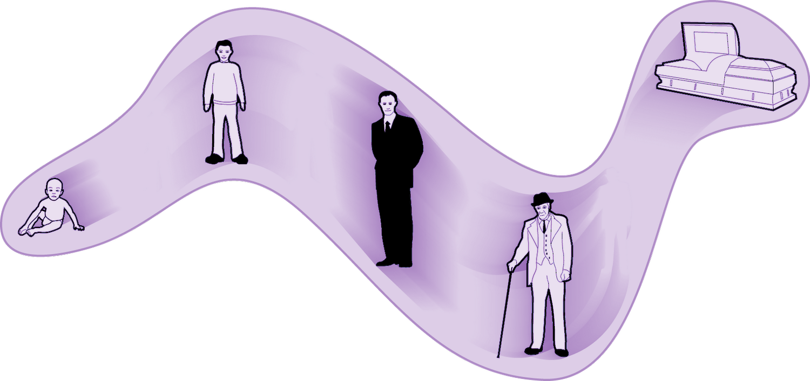

# DEATH

**Death** is an inevitable reality faced by all living beings. Everything that begins will end in one way or another in time. However, the common understanding of time as a linear progression, with only one moment existing sequentially, is a misconception that limits our understanding of existence. To discuss the concept of death and its implications, it is necessary to explore the fundamental structure of time.

## The Simultaneity of Moments

In reality, all moments—past, present, and future—exist, and in a sense that we can think of as simultaneous. The human experience of time is limited to navigating these moments sequentially, creating the illusion of a singular, fleeting present. However, everything that ever existed continues to exist in the time in which it occurred.

The perception of moments in time as ephemeral and time as linear—a past that has ceased, a future yet to unfold, and a present as the sole reality—is shaped by our experience of causality and its unidirectional flow. However, this perception that a time no longer exists because we are not experiencing it in a given moment is an illusion. Time, being the fourth dimension, is analogous to space. Just as objects occupy different positions in space, events that are not currently intersecting with a given timeframe still exist, merely situated differently within the temporal continuum.

## The Eternal Persistence of Moments

In this view of time, all moments exist eternally, with every past, present, and future instance happening indefinitely. Consequently, a person's life, while not extending into all future moments, persists forever within its original temporal context.

A person's life can be conceptualized as a thread woven through the fabric of space-time. Each point on the thread represents a moment in their life, and while the thread may not extend indefinitely into the future, it remains an eternal part of the tapestry of existence.

## The Eternal Persistence of Experience

In a Universe where all moments are eternally fixed, every instance of suffering and pleasure continues indefinitely within the immutable structure of space-time. Experiences such as pain, regret, love, and joy are forever preserved, never truly fleeting.

Choices and actions have eternal significance, as they become indelible parts of the cosmic record. The eternal persistence of experience is a fundamental truth that illuminates the significance of the consequences of actions and the importance of living intentionally.

## Loss and Grief

The eternal persistence of moments has direct implications for our understanding of loss and grief. When a loved one dies, their absence from the present moment can cause significant emotional pain. However, their existence continues within their own temporal context, even if they are not with us in what we perceive as the present. They remain an eternal part of the Universe's structure.

This perspective provides a different framework for understanding and accepting the nature of existence. Remembering and honoring the eternal essence of those who have been lost is a meaningful way to acknowledge that their presence is forever woven into the fabric of reality.

## EXTERNAL SOURCES

This tenet aligns with various philosophical and scientific theories of time:

- [Four-dimensionalism](https://en.wikipedia.org/wiki/Four-dimensionalism) - This theory treats time as a fourth dimension alongside the three spatial dimensions, viewing an object's persistence through time as analogous to its extension in space. Just as an object occupies a continuous region of space, it also occupies a continuous region of space-time, supporting the idea that all moments of an object's existence are equally real and eternally present.

- [Eternalism](https://en.wikipedia.org/wiki/Eternalism_(philosophy_of_time)) - This philosophical position asserts that all points in time are equally real and that the present moment does not have any special ontological status. The past, present, and future are all considered to be equally existent, and the apparent passage of time is seen as an illusion or a product of human perception. Eternalism provides a foundation for understanding the simultaneous existence of all moments and the eternal persistence of events and experiences.

- [B-theory of time](https://en.wikipedia.org/wiki/B-theory_of_time) - This theory regards the flow of time as a subjective human illusion, proposing that the fundamental nature of time is tenseless. The distinction between past, present, and future is not considered an objective feature of reality, and all events in time are viewed as equally real and existing in a static, block-like universe. The B-theory of time supports the idea that all moments are eternally fixed and that the passage of time is a perceptual artifact rather than an objective reality.

- [Growing block universe](https://en.wikipedia.org/wiki/Growing_block_universe) - This theory proposes that the past and present both exist, but the future does not yet exist. As time progresses, new events are added to the "block" of reality, continually increasing its size. However, once an event has occurred, it becomes part of the unchanging past, forever fixed in the block universe. The growing block universe theory offers a slightly different perspective on the eternal nature of the past and present, while still maintaining the idea that death does not erase an individual's existence from the cosmic record.
