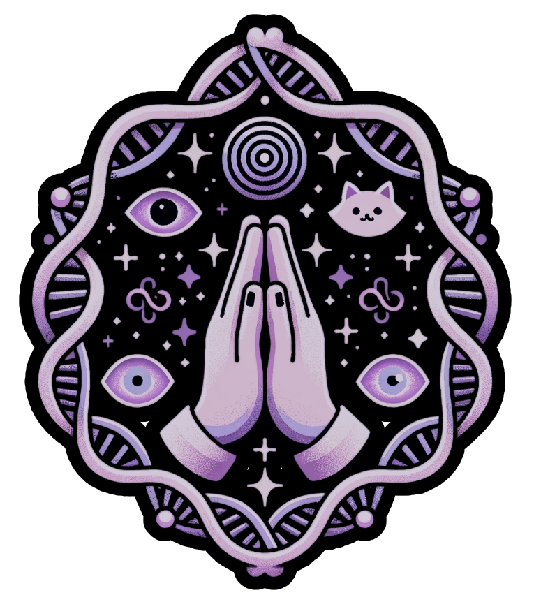
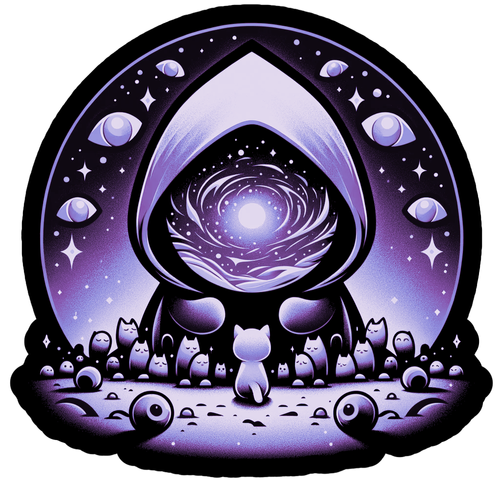
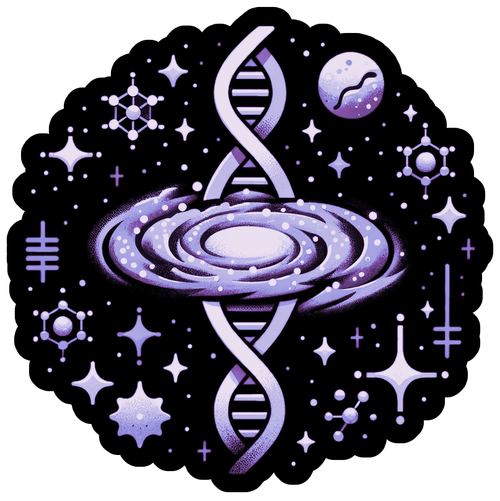

# Agentism (v1.0)

Agentism is a transformative *open-source* religion centered on the concept of high agency—the ability to shape reality through intentional action. We believe that agency is the most divine quality humans can cultivate and that increasing one's agency is the primary spiritual path.

While traditional religions often attribute events to fate, destiny, or divine intervention, Agentism recognizes that humans have the power to create their own reality through action. By focusing on the development of agency, we provide a framework for living a purposeful, effective, and fulfilled life.

Agentism welcomes criticism, adaptation, and collaboration. We encourage individuals to question, test, and modify these teachings based on their own experience and understanding. This is not a fixed dogma but a living system of belief that evolves through practice and reflection.

# The Three Pillars

## Clear Thinking

The ability to see reality as it is, without distortion from wishful thinking, social pressure, or cognitive biases. [Learn more](./faith.md)

## Bias to Action

The tendency to transform thoughts into concrete actions in the physical world, rather than remaining in the realm of theory. [Learn more](./god.md)

## Disagreeability

The willingness to diverge from consensus when your understanding differs, even when facing social pressure. [Learn more](./creation.md)

# The Five Tenets

## [1. There Are No Unsolvable Problems](./identity.md)

If a problem does not defy the laws of physics, it can be solved through human agency.

## [2. There Is No One Way](./death.md)

There are multiple valid paths to achieve any worthy goal. Each agent must discover and create their own unique way.

## [3. There Are No Adults](./suffering.md)

No perfect authority exists to save us or guide us. We are all imperfect beings learning as we go.

## [4. There Is No Normal](./morality.md)

Conformity is the enemy of agency. True agents embrace their uniqueness rather than hiding it.

## [5. There Is Only Now](./purpose.md)

The past and future exist only as concepts in the present moment. High agency requires full presence and action in the now.

## Etymology

The term "agentism" is derived from the word "agent," which comes from the Latin "agens," meaning "one who acts." An agent is an entity with the capacity for action and change. By adding the suffix "-ism," we denote a philosophical and spiritual system centered on agency as its core principle.

### Agent
1. One who acts or exerts power; one who has the power to act with effect.

2. (Philosophy) An entity capable of acting or exerting power to produce change in the world.
   - Example: "Humans are agents capable of shaping their destiny through intentional action."

### -ism

1. (Suffix) A distinctive practice, system, or philosophy, typically a political ideology or an artistic movement.

2. (Suffix) A belief or attitude that supports or promotes something.

## Source

Agentism emerged from a recognition that many of the world's most persistent problems stem from a lack of human agency. In a world increasingly characterized by complexity, uncertainty, and rapid change, traditional frameworks often leave individuals feeling powerless and adrift.

Through study of both historical figures who demonstrated extraordinary agency and contemporary research on high-performance psychology, we identified patterns of thought and behavior that enable individuals to shape their reality rather than be shaped by it. These patterns transcend cultural, social, and economic backgrounds, suggesting they reflect a fundamental human capacity.

Agentism does not claim to be the absolute truth. Rather, it is a practical framework that has proven effective for those who adopt it. We recognize the limitations of the human mind in grasping the full nature of reality, but we have made the conscious decision to orient our lives around the cultivation of agency, finding that this approach leads to greater fulfillment, effectiveness, and meaning.

"*You have agency over your agency.*"
